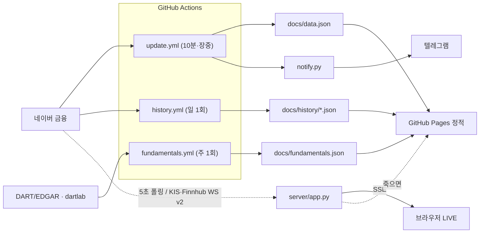

# ⚡ 에너지 인프라 대시보드

AI capex / 전력 인프라 테마 **38종목(미국+한국)** 모니터링. 캔들/RSI 차트 · 히트맵 · 변화 피드 ·
공시 펀더멘털 · (선택) 실시간 SSE까지. 빌드 도구 0, 프론트는 순수 vanilla JS.

> 스크린샷: _표 모드 / 히트맵 / 종목 차트 (추가 예정)_

## 세 가지 모드

| 모드 | 갱신 | 사용법 | 배지 |
|---|---|---|---|
| **로컬 (실시간)** | 7초 시세 / 10분 지표 | `python3 dashboard.py` → http://localhost:8765 | 로컬 실시간 |
| **GitHub Pages (정적)** | 장중 10분 (5~15분 지연) | `docs/` Pages URL 접속 | 정적 모드 |
| **LIVE (SSE push)** | 5초 push | 백엔드 기동 + `BACKEND_URL` 설정 → Pages가 자동 승격 | LIVE 🔴 |

LIVE 백엔드가 죽으면 프론트는 **30초 내 정적 모드로 자동 강등**된다 (회귀 0). `BACKEND_URL=null`(기본)이면
기존 두 모드와 100% 동일하게 동작한다.

의존성 0 — `dashboard.py`/`fetch_data.py`는 파이썬 표준 라이브러리만 사용. 데이터: 네이버 금융 API
(키 불필요. 야후 API는 IP 차단이 잦아 미사용). 펀더멘털/LIVE 백엔드만 별도 의존성으로 격리.

## 아키텍처



## 구조

| 파일 | 역할 |
|---|---|
| `dashboard.py` | 로컬 서버 + `UNIVERSE`/지표 정의 (**단일 소스**) + `/api/data` · `/api/history` |
| `fetch_data.py` | Actions 수집 → `docs/data.json` (+ `WRITE_HISTORY=1` 시 `docs/history/`) |
| `fetch_fundamentals.py` | dartlab 공시 → `docs/fundamentals.json` (의존성 격리) |
| `notify.py` | 신규 트리거 텔레그램 알림 (표준 라이브러리) |
| `server/` | LIVE SSE 백엔드 (FastAPI) — [README](server/README.md) · [배포](server/DEPLOY.md) |
| `docs/index.html` | Pages 대시보드 (호스트 자동 감지로 로컬/정적/LIVE 전환) |
| `tests/` | 지표·스키마 단위 테스트 (CI 전용) |

### 워크플로우

- `update.yml` — 시세 10분 (장중) · `history.yml` — 일봉 일 1회 · `fundamentals.yml` — 펀더멘털 주 1회 · `ci.yml` — pytest + ruff
- 각 워크플로우는 concurrency 그룹이 분리돼 서로 영향이 없다.

## 펀더멘털 (dartlab)

영업이익률·부채비율·매출성장·신용등급(한국 dCR)을 [dartlab](https://github.com/eddmpython/dartlab)
(Apache-2.0, DART+EDGAR 공시 기반, API 키 불필요)로 주 1회 수집한다. 표 모드의 **펀더멘털** 토글로 표시하며,
`fundamentals.json`이 없어도 대시보드는 정상 동작한다 (점진적 도입).

## 알림 (텔레그램)

`update.yml`이 매 수집마다 직전 `data.json`과 비교해 **새로 발생한 트리거만** 보낸다 (중복 방지).
GitHub Secrets `TELEGRAM_BOT_TOKEN` · `TELEGRAM_CHAT_ID` 설정 시 활성화, 미설정 시 조용히 skip.

트리거: 당일 ±3% 신규 · 거래량 20일평균 2배 신규 · RSI 70/30 크로스 · 52주 신고가.

## 색상 트리거 (대시보드)

당일 ±3% · 52주 고점 -5% 이내(초록)/-20% 이탈(빨강) · RSI 70/30 · 거래량 20일 평균 2배+ · 200일선 이탈 · 어닝 D-7 배지

## 개발

```bash
python3 dashboard.py          # 로컬 대시보드
python3 dashboard.py --selftest
pytest -q                     # 테스트 (pip install pytest ruff)
ruff check .
```

## 유니버스 수정

`dashboard.py`의 `UNIVERSE` 딕셔너리에 한 줄 추가/삭제하면 로컬·Pages·LIVE 모든 모드에 반영된다.
